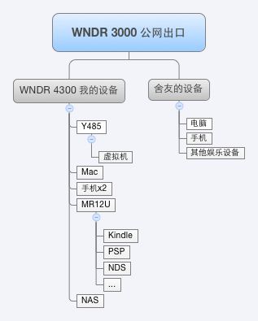

## 基础网络使用

计划中的网络结构图如下：

### 使用多路由原因

- 主路由外接光猫，由我和舍友一同共用，已知路由同时接入设备过多，会影响性能，不如添加一个路由来分级处理，而且可以很方便的改路由表策略来实现高速内部网络环境。
- 二级路由下又有三级路由是因为二级路由为了提高无线速度和安全性，对于2G和5G网络皆锁定频率到40HGz（这个是不符合标准的），传输使用AES+WPAK2（旧设备不支持），所以需要额外添加一个小路由做临时网络环境扩展。
- 自己的网络环境有NAS存在，需要隔离网络，以及提供内部高速访问。

### 有线无线的混合使用

- WNDR4300和 WNDR3000使用超五类线进行链接，达到路由间百兆带宽传输（传输速率10MB/s+）
- WNDR提供双40HMz的无线信号，传输速率20MB/s+
- WNDR4300和Y485使用超六类线连接，待利用（添加另外一台笔记本的时候，超六类的速率就发挥出来鸟）
- 访问NAS
	- 使用有线读写速度在60~80M/s+，
	- 使用5G Wifi，读写速度在18~24M/s+（Mac）
	- 娱乐设备未测试，DLNA完全不卡就足够了...

### 网络地址分配

- 由于电信猫默认网关是192.168.1.1，为了区分和回避：
	- 主路由使用`10.0.0.1`
	- 二级路由使用`10.10.1.1`
		- 笔记本设备地址`10.10.1.100~10.10.1.110`
		- 手机等娱乐设备的地址`10.10.1.200~10.10.1.220`
		- 开发虚拟机使用地址`10.10.1.150~10.10.1.180`
	- NAS
		- 第一台使用`10.10.10.99`
	- 三级路由使用`10.10.10.1`
		- 三级路由连接设备不做地址静态分配

### 简单的网络安全配置

- [x] 光猫无须设置（仅提供线缆链接到WNDR3000），
- [x] WNDR3000无线设置较强密码（考虑定期更换）
- [x] WNDR4300无线设置较强密码（主要目的加密传输内容） && Mac绑定
- [x] MR12U无线不设密码（妥协老设备且无加密必要性） && Mac绑定
- [x] NAS简单的安全设置，以及用户组权限设置。
- [ ] 笔记本皆禁止反向连接